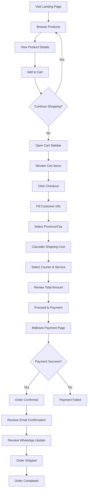
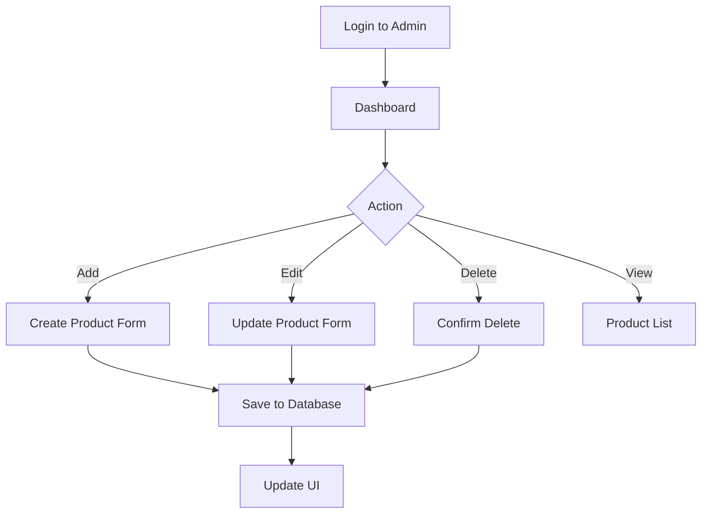
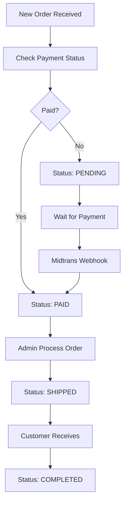

# Product Specification Document
## Herbal Shop - E-Commerce Platform

**Version:** 1.0  
**Last Updated:** 18 Desember 2025  
**Author:** Product Development Team

---

## 1. Executive Summary

Herbal Shop adalah platform e-commerce berbasis web yang dirancang khusus untuk penjualan produk herbal dan kesehatan. Platform ini menggabungkan pengalaman berbelanja modern dengan fitur-fitur khusus untuk pasar Indonesia, termasuk integrasi pembayaran lokal, pengiriman logistik nasional, dan notifikasi multi-channel.

### 1.1 Tujuan Produk
- Menyediakan platform penjualan online yang mudah digunakan untuk produk herbal
- Meningkatkan jangkauan pasar dengan kemudahan akses 24/7
- Memberikan pengalaman berbelanja yang seamless dari browsing hingga pembayaran
- Menyediakan sistem manajemen pesanan dan inventory yang efisien

### 1.2 Target Pengguna
- **Primary:** Konsumen produk herbal dan kesehatan di Indonesia
- **Secondary:** Admin/pemilik toko untuk manajemen produk dan pesanan
- **Demographics:** Usia 25-55 tahun, peduli kesehatan, familiar dengan belanja online

---

## 2. Technology Stack

### 2.1 Frontend
- **Framework:** Next.js 14.2.5 (React 18)
- **Styling:** TailwindCSS 3.3.0
- **State Management:** Zustand 4.5.1
- **Animation:** Framer Motion 11.0.8
- **Form Handling:** React Hook Form 7.51.0
- **Validation:** Zod 3.22.4
- **Icons:** Lucide React 0.344.0
- **HTTP Client:** Axios 1.6.7

### 2.2 Backend
- **Database:** PostgreSQL (via Supabase)
- **ORM:** Prisma 5.10.2
- **API:** Next.js API Routes
- **Authentication:** Supabase Auth

### 2.3 Third-Party Integrations
- **Payment Gateway:** Midtrans Client 1.3.1
- **Shipping:** RajaOngkir API
- **Email Notifications:** Resend 6.6.0
- **WhatsApp Notifications:** (Custom Integration)
- **Storage:** Supabase Storage

### 2.4 Deployment
- **Platform:** Cloudflare Pages
- **Build Tool:** @cloudflare/next-on-pages 1.13.16
- **CDN:** Cloudflare CDN
- **Edge Computing:** Wrangler 4.54.0

---

## 3. Core Features

### 3.1 Landing Page & Katalog Produk

#### 3.1.1 Hero Section
- **Deskripsi:** Banner utama dengan call-to-action menarik
- **Komponen:** 
  - Headline dan subheadline produk
  - CTA button untuk mulai berbelanja
  - Visual appealing dengan animasi

#### 3.1.2 Flash Sale
- **Deskripsi:** Menampilkan produk dengan diskon terbatas waktu
- **Fitur:**
  - Countdown timer real-time
  - Highlight produk diskon
  - Visual yang eye-catching
  - Server-side rendering untuk konsistensi

#### 3.1.3 Product Showcase
- **Deskripsi:** Katalog produk utama
- **Fitur:**
  - Grid layout responsif
  - Product card dengan:
    - Gambar produk
    - Nama produk
    - Harga
    - Rating (bintang)
    - Stok status
  - Tombol "Tambah ke Keranjang"
  - Filter dan sorting (future enhancement)

#### 3.1.4 About Us
- **Deskripsi:** Informasi tentang toko dan nilai-nilai brand
- **Konten:**
  - Visi dan misi
  - Keunggulan produk herbal
  - Sertifikasi/izin (jika ada)

#### 3.1.5 Testimonials
- **Deskripsi:** Review dan testimoni pelanggan
- **Fitur:**
  - Carousel testimoni
  - Rating pelanggan
  - Foto pelanggan (optional)

### 3.2 Shopping Cart & Checkout

#### 3.2.1 Cart Sidebar
- **Deskripsi:** Panel samping untuk menampilkan items yang akan dibeli
- **Fitur:**
  - Daftar produk dalam keranjang
  - Quantity adjuster (+/-)
  - Remove item
  - Subtotal calculation
  - Tombol checkout
  - Slide-in animation

#### 3.2.2 Checkout Process
- **Step 1: Customer Information**
  - Nama lengkap
  - Email
  - Nomor telepon
  - Alamat lengkap

- **Step 2: Shipping Calculation**
  - Pilih provinsi
  - Pilih kota/kabupaten
  - Pilih kurir (JNE, TIKI, POS Indonesia)
  - Lihat estimasi ongkir
  - Pilih layanan pengiriman (REG, YES, OKE, dll)

- **Step 3: Payment**
  - Integration dengan Midtrans
  - Multiple payment methods:
    - Credit/Debit Card
    - Bank Transfer
    - E-Wallet (GoPay, OVO, DANA, dll)
    - Indomaret/Alfamart
    - Kredivo

- **Step 4: Order Confirmation**
  - Order summary
  - Order ID
  - Payment instructions
  - Tracking information

### 3.3 Payment System

#### 3.3.1 Midtrans Integration
- **Snap Token Generation:** Server-side token creation
- **Payment Modal:** Embedded Midtrans Snap popup
- **Payment Status:**
  - Pending
  - Paid
  - Expired
  - Failed
- **Webhook Handler:** Automatic payment notification processing

#### 3.3.2 Order Management
- **Order Statuses:**
  - PENDING (awaiting payment)
  - PAID (payment confirmed)
  - SHIPPED (in delivery)
  - COMPLETED (delivered)
  - CANCELLED (order cancelled)

### 3.4 Shipping Integration

#### 3.4.1 RajaOngkir API
- **Province Lookup:** Daftar provinsi di Indonesia
- **City Lookup:** Daftar kota/kabupaten per provinsi
- **Cost Calculation:** 
  - Input: Origin, Destination, Weight (grams), Courier
  - Output: Available services dengan harga dan estimasi
- **Supported Couriers:**
  - JNE
  - TIKI
  - POS Indonesia

#### 3.4.2 Mock Mode
- Fallback data ketika API key tidak tersedia
- Data sampel untuk development

### 3.5 Notification System

#### 3.5.1 Email Notifications (via Resend)
- **Order Confirmation:** Email setelah order dibuat
- **Payment Confirmation:** Email setelah pembayaran sukses
- **Shipping Update:** Email saat order dikirim
- **Template:** HTML email template dengan branding

#### 3.5.2 WhatsApp Notifications
- Order updates via WhatsApp Business API
- Customer service integration

### 3.6 Marketing & Campaigns

#### 3.6.1 Marketing Campaign Types
- **Coupon Codes:**
  - Unique code generation
  - Discount value (percentage or fixed)
  - Start and end dates
  - Active/inactive status

- **Flash Sales:**
  - Time-limited discounts
  - Countdown timer
  - Special pricing

- **Banners:**
  - Promotional banners
  - Scheduled display

---

## 4. Database Schema

### 4.1 Product Model
```prisma
- id: String (CUID)
- name: String
- description: String
- price: Int (in rupiah)
- stock: Int
- weight: Int (in grams)
- image: String (optional)
- rating: Float (default 0)
- createdAt: DateTime
- updatedAt: DateTime
```

### 4.2 Order Model
```prisma
- id: String (CUID)
- customerName: String
- customerEmail: String
- customerPhone: String
- address: String
- totalAmount: Int
- shippingCost: Int
- status: OrderStatus (enum)
- paymentStatus: String
- snapToken: String (optional)
- items: OrderItem[]
- createdAt: DateTime
- updatedAt: DateTime
```

### 4.3 OrderItem Model
```prisma
- id: String (CUID)
- orderId: String
- productId: String
- quantity: Int
- price: Int (price at purchase)
```

### 4.4 MarketingCampaign Model
```prisma
- id: String (CUID)
- type: String (COUPON, FLASH_SALE, BANNER)
- code: String (unique, optional)
- value: Int (optional)
- isActive: Boolean
- startDate: DateTime
- endDate: DateTime
- createdAt: DateTime
- updatedAt: DateTime
```

---

## 5. User Flows

### 5.1 Customer Purchase Flow


### 5.2 Admin Product Management Flow


### 5.3 Order Management Flow


---

## 6. API Endpoints

### 6.1 Product APIs
- **GET /api/products** - Get all products
- **GET /api/products/[id]** - Get single product
- **POST /api/products** - Create product (admin)
- **PUT /api/products/[id]** - Update product (admin)
- **DELETE /api/products/[id]** - Delete product (admin)

### 6.2 Order APIs
- **POST /api/orders** - Create order
- **GET /api/orders/[id]** - Get order details
- **POST /api/orders/payment** - Generate Midtrans token
- **POST /api/orders/webhook** - Midtrans payment webhook

### 6.3 Shipping APIs
- **GET /api/shipping/provinces** - Get provinces
- **GET /api/shipping/cities?province_id=X** - Get cities
- **POST /api/shipping/cost** - Calculate shipping cost

### 6.4 Marketing APIs
- **GET /api/campaigns** - Get active campaigns
- **POST /api/campaigns/validate** - Validate coupon code

---

## 7. Security & Privacy

### 7.1 Environment Variables
```
DATABASE_URL - Supabase PostgreSQL connection
DIRECT_URL - Direct database connection
NEXT_PUBLIC_SUPABASE_URL - Supabase project URL
NEXT_PUBLIC_SUPABASE_ANON_KEY - Supabase anonymous key
SUPABASE_SERVICE_KEY - Supabase service role key
MIDTRANS_SERVER_KEY - Midtrans server key
MIDTRANS_CLIENT_KEY - Midtrans client key
RAJAONGKIR_API_KEY - RajaOngkir API key
RESEND_API_KEY - Resend email API key
WHATSAPP_API_KEY - WhatsApp API credentials
```

### 7.2 Data Protection
- Sensitive data encrypted in database
- HTTPS/SSL encryption for all traffic
- Environment variables not committed to git
- API keys stored securely in `.env`

### 7.3 Payment Security
- PCI DSS compliance via Midtrans
- No credit card data stored locally
- Secure webhook verification
- Token-based payment flow

---

## 8. Performance Optimization

### 8.1 Frontend Optimization
- **Next.js SSR/SSG:** Server-side rendering untuk SEO
- **Image Optimization:** Next.js Image component
- **Code Splitting:** Automatic route-based splitting
- **Lazy Loading:** Components loaded on demand
- **CDN:** Cloudflare CDN untuk static assets

### 8.2 Database Optimization
- **Indexing:** Primary keys dan foreign keys
- **Connection Pooling:** Prisma connection pooling
- **Query Optimization:** Efficient Prisma queries

### 8.3 Caching Strategy
- **Static Generation:** Pre-render pages saat build
- **Incremental Static Regeneration:** Update pages tanpa rebuild
- **API Caching:** Cache external API responses
- **Edge Caching:** Cloudflare edge caching

---

## 9. Deployment & DevOps

### 9.1 Build Process
```bash
npm run build          # Build Next.js application
npm run pages:build    # Build for Cloudflare Pages
```

### 9.2 Development Workflow
```bash
npm run dev           # Local development server
npm run pages:dev     # Test Cloudflare Pages locally
```

### 9.3 Deployment
```bash
npm run pages:deploy  # Deploy to Cloudflare Pages
```

### 9.4 Database Migrations
```bash
npx prisma migrate dev      # Development migrations
npx prisma migrate deploy   # Production migrations
npx prisma generate         # Generate Prisma Client
npm run prisma db seed      # Seed database
```

---

## 10. Content Pages

### 10.1 Information Pages
- **/cara-pemesanan** - Panduan cara order
- **/pengiriman** - Informasi pengiriman
- **/kebijakan-privasi** - Privacy policy
- **/syarat-ketentuan** - Terms and conditions
- **/kontak** - Contact information

### 10.2 Admin Pages
- **/admin** - Admin dashboard
- **/admin/products** - Product management
- **/admin/orders** - Order management
- **/admin/campaigns** - Marketing campaign management

---

## 11. Future Enhancements

### 11.1 Phase 2 Features
- [ ] Customer account registration & login
- [ ] Order history untuk registered users
- [ ] Wishlist functionality
- [ ] Product reviews dan ratings
- [ ] Advanced product filtering dan search
- [ ] Live chat customer support

### 11.2 Phase 3 Features
- [ ] Mobile app (React Native)
- [ ] Loyalty program & points
- [ ] Subscription/recurring orders
- [ ] Multi-vendor marketplace
- [ ] Advanced analytics dashboard
- [ ] AI-powered product recommendations

### 11.3 Technical Improvements
- [ ] Unit testing (Jest, React Testing Library)
- [ ] E2E testing (Playwright)
- [ ] Performance monitoring (Sentry)
- [ ] A/B testing framework
- [ ] GraphQL API layer
- [ ] Redis caching

---

## 12. Success Metrics (KPIs)

### 12.1 Business Metrics
- **Conversion Rate:** % visitors yang melakukan purchase
- **Average Order Value (AOV):** Rata-rata nilai transaksi
- **Cart Abandonment Rate:** % cart yang tidak checkout
- **Customer Acquisition Cost (CAC)**
- **Customer Lifetime Value (CLV)**

### 12.2 Technical Metrics
- **Page Load Time:** < 3 detik
- **Time to Interactive (TTI):** < 5 detik
- **First Contentful Paint (FCP):** < 2 detik
- **API Response Time:** < 500ms
- **Uptime:** 99.9%
- **Error Rate:** < 0.1%

### 12.3 User Experience Metrics
- **Bounce Rate:** < 40%
- **Session Duration:** > 3 menit
- **Pages per Session:** > 3
- **Mobile Traffic:** Tracking mobile vs desktop
- **Payment Success Rate:** > 95%

---

## 13. Support & Maintenance

### 13.1 Customer Support Channels
- **Email:** support@herbalshop.com
- **WhatsApp:** Customer service via WA Business
- **FAQ:** Comprehensive FAQ section
- **Live Chat:** (Future implementation)

### 13.2 Maintenance Schedule
- **Daily:** Database backups
- **Weekly:** Security updates check
- **Monthly:** Performance review
- **Quarterly:** Feature updates

### 13.3 Monitoring & Alerts
- Uptime monitoring (UptimeRobot/Pingdom)
- Error tracking (Sentry)
- Analytics (Google Analytics)
- Payment monitoring (Midtrans dashboard)

---

## 14. Compliance & Legal

### 14.1 Indonesian E-Commerce Regulations
- Comply with UU ITE (Informasi dan Transaksi Elektronik)
- BPOM registration untuk produk herbal (if required)
- Halal certification display (if applicable)
- Consumer protection laws

### 14.2 Data Privacy
- GDPR-compliant (for international customers)
- Indonesia data protection compliance
- Clear privacy policy
- Cookie consent management

### 14.3 Tax Compliance
- PPN (Pajak Pertambahan Nilai) calculation
- Tax invoice generation
- Reporting untuk Direktorat Jenderal Pajak

---

## 15. Appendix

### 15.1 Glossary
- **CUID:** Collision-resistant Unique Identifier
- **SSR:** Server-Side Rendering
- **SSG:** Static Site Generation
- **ISR:** Incremental Static Regeneration
- **CDN:** Content Delivery Network
- **ORM:** Object-Relational Mapping

### 15.2 References
- [Next.js Documentation](https://nextjs.org/docs)
- [Prisma Documentation](https://www.prisma.io/docs)
- [Midtrans Documentation](https://docs.midtrans.com)
- [RajaOngkir Documentation](https://rajaongkir.com/dokumentasi)
- [Supabase Documentation](https://supabase.com/docs)

### 15.3 Contact Information
**Development Team:**
- Product Owner: [Name]
- Tech Lead: [Name]
- Frontend Developer: [Name]
- Backend Developer: [Name]
- DevOps Engineer: [Name]

---

**Document Status:** ✅ Approved  
**Next Review Date:** [Date]  
**Document Owner:** Product Development Team
